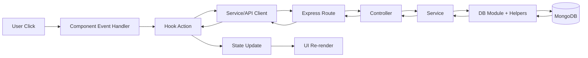
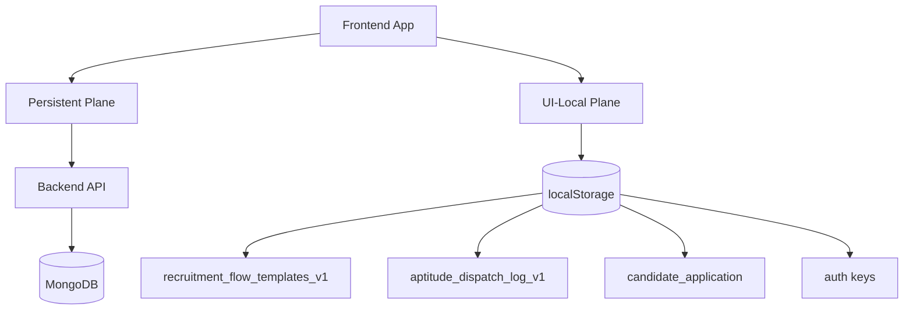
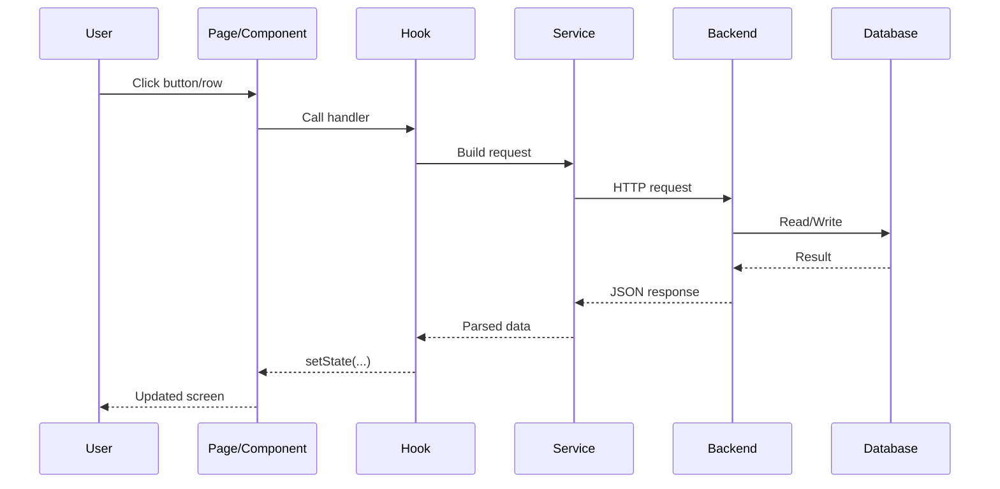
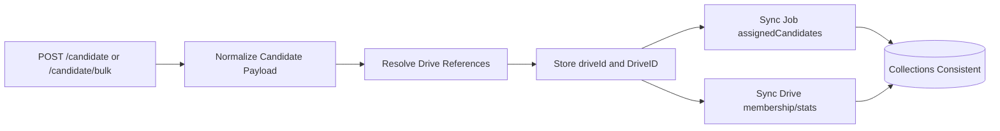
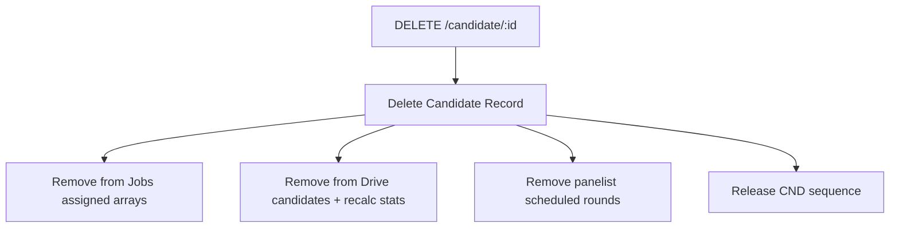

# Project Full Data Flow and User Interaction Playbook

Last updated: 2026-03-06

This file is the detailed "what happens when user clicks" reference.
It includes:
1. Hook input/output flow
2. Props flow from page to components
3. Function and API flow
4. End-to-end interaction flow for each screen

---

## 1) End-to-End Architecture

Frontend data flow:
`Route -> Page -> Hook -> Service/API Client -> Backend API -> DB layer/helpers -> Response -> Hook state update -> UI re-render`

Backend data flow:
`Route file -> Controller -> Service -> DB module -> DB helpers (normalization/sync) -> MongoDB`

Two data planes exist:
1. **Persistent plane**: Backend + MongoDB (Candidates, Drives, Jobs, Panelists, Users)
2. **UI-local plane**: Browser localStorage (auth flags, recruitment flow templates, aptitude dispatch logs, candidate application draft)

### Visual Map: End-to-End Data Flow

### Visual Map: Persistent vs Local Planes

---

## 2) Hook Input/Output Flow

## 2.1 `useLoginPage({ navigate })`

Input:
- `navigate(path)` from React Router

Output:
- State: `activeTab`, `email`, `password`
- Setters: `setActiveTab`, `setEmail`, `setPassword`
- Constants: `roleTabs`
- Action: `handleSubmit(event)`

Flow:
- `handleSubmit` checks selected role.
- Candidate login sets:
  - `candidate_auth`, `candidate_name`, `candidate_email`
- HR login sets:
  - `hr_auth`, `hr_email`
- Then route navigation happens.

## 2.2 `useCandidateApplicationForm({ navigate })`

Input:
- `navigate`

Output:
- Step and form state
- Field update functions
- Resume handlers
- `handleNext`, `handlePrevious`, `handleStepClick`, `handleSubmit`

Flow:
- Reads existing local draft from `candidate_application`.
- Prefills with logged-in candidate (API read).
- On submit:
  - validates current step
  - saves local payload (`saveCandidateApplication`)
  - navigates to dashboard

## 2.3 `useCandidateDashboard({ navigate })`

Input:
- `navigate`

Output:
- `dashboardData`
- loading/error
- notifications open/close/toggle
- logout handler

Flow:
- Reads saved application + fetches live candidate.
- Resolves recruitment flow stages for candidate timeline.
- Computes derived UI state (firstName, GD progress, unread count).

## 2.4 `useCreateUsers({ drivesProp })`

Input:
- optional initial drives list

Output (main):
- data: `candidates`, `jobs`, `drives`
- filters: `searchTerm`, `collegeFilter`, `jobFilter`
- modal state: assign/edit
- actions: create, bulk delete, assign, edit, import, export

Flow:
- Create candidate -> `POST /candidate`
- Import CSV -> parse -> `POST /candidate/bulk`
- Edit candidate -> `PATCH /candidate/:id`
- Delete selected -> `DELETE /candidate/:id` for each selected
- Assign jobs -> `PATCH /candidate/:id` with `AssignedJobs`

## 2.5 `useCreateJob({ onJobAssignment, onJobsUpdate })`

Input:
- optional callbacks

Output:
- jobs state + filters + handlers

Flow:
- Create job -> `POST /job`
- Delete job -> `DELETE /job/:id`
- Read jobs/candidates for list and assignment count views.

## 2.6 `useCreatePanelist({ onPanelistsUpdate })`

Input:
- optional callback

Output:
- panelist state + modal state + schedule state + handlers

Flow:
- Create panelist -> `POST /panelist`
- Assign jobs -> `PUT /panelist/:id`
- Schedule round -> `PUT /panelist/:id` with `scheduledRounds`
- Delete panelist -> `DELETE /panelist/:id`

## 2.7 `useDriveManagement({ onDrivesUpdate })`

Input:
- optional callback

Output:
- drive form/filter state
- stats
- CRUD/edit handlers

Flow:
- Create drive -> `POST /drive`
- Edit drive -> `PUT /drive/:id`
- Delete drive -> `DELETE /drive/:id`
- List drives/jobs for filter and stats.

## 2.8 `useDrivePage({ driveId })`

Input:
- URL `driveId`

Output:
- `drive`, `jobRows`, loading/error

Flow:
- Reads drive/candidates/jobs/panelists.
- Builds per-job candidate count + mapped panelists.

## 2.9 `useDriveCandidates({ jobName, driveId })`

Input:
- selected job and drive from route/context

Output:
- filtered candidates + helpers + reload

Flow:
- Reads candidates/drives/jobs.
- Filters by drive references + assigned job mapping.

## 2.10 `useDriveJobScoreboard({ driveId, jobName })`

Input:
- selected drive + job

Output:
- `rows`, `driveLabel`, `jobLabel`, loading/error

Flow:
- Reads candidates/drives/jobs/panelists.
- Builds leaderboard rows with Aptitude/GD/PI scores and mapped panelists.

## 2.11 `useRecruitmentPipeline({ colors })`

Input:
- color palette

Output:
- view state
- selector state (drive/job)
- template state
- save/delete handlers

Flow:
- Reads drives/jobs from API.
- Saves/deletes templates in localStorage (`recruitment_flow_templates_v1`).

## 2.12 `useAptitudeTestManagement({ colors })` + `useAptitudeSelectionState(...)`

Input:
- palette + selector/search state

Output:
- dispatch page state
- candidate selection state
- send handler

Flow:
- Reads drives/jobs/candidates from API.
- `Send Link` generates custom aptitude IDs and writes dispatch records to localStorage.

---

## 3) Props Flow (Page -> Child Components)

## 3.1 Candidate

- `CandidateDashboard`
  - `DashboardHeader`: notifications and logout callbacks
  - `ActionButtons`: `onViewApplication`, `onViewNotifications`
  - cards/timeline receive derived values from hook

- `Applicationform`
  - `StepTabs`: step index and click handler
  - step forms receive `formData` + update handlers
  - `FormActions` receives next/previous/submit handlers

## 3.2 HR management pages

- `CreateUsers`
  - `UserFormCard`: `newUser`, `setNewUser`, `createCandidate`, `onImportClick`
  - `UsersTableHeader`: filters + CSV export action
  - `UserTableRow`: candidate row data + checkbox/edit callbacks
  - `AssignJobModal`: selected candidate IDs + `onAssigned`
  - `EditCandidateModal`: candidate + drives + save callback

- `CreateJob`
  - `JobFormCard`: job form state + create handler
  - `JobsTableHeader`: search state
  - `JobTableRow`: row data + delete + row-click
  - `JobCandidatesModal`: selected job and candidates

- `CreatePanelist`
  - `PanelistFormCard`: form state + create handler
  - `PanelistsTableHeader`: filters
  - `PanelistTableRow`: assign/schedule/delete callbacks
  - `AssignJobModal` + `ScheduleRoundModal`

- `DriveManagement`
  - `DriveFormCard`: form state + create handler
  - `DrivesTableHeader`: list filters
  - `DriveTableRow`: row-click view/edit/delete callbacks
  - `EditDriveModal`: edit state + save callback

- `DrivePage`
  - `DriveOverviewCard`, `DriveKpiStrip`, `DriveJobBreakdown`
  - `DriveJobBreakdown` row click navigates to drive-job candidates page.

## 3.3 HR process pages

- `RecruitmentPipeline`
  - `RecruitmentPipelineHomeView`
  - `RecruitmentPipelineBuilderView` (selectors + stages + save)
  - `RecruitmentPipelineListView` (template table + delete)

- `AptitudeTestManagement`
  - `AptitudeHomeView`
  - `AptitudeDispatchView` (selectors, link, select-all, send)
  - `AptitudeCandidatesTable`
  - `AptitudeListView`

- `DriveJobCandidateScoreboardPage`
  - local selector state (non-context mode)
  - scoreboard data from `useDriveJobScoreboard`

---

## 4) Interaction Flow by Screen (Detailed)

### Visual Map: Generic Interaction Cycle

## 4.1 Login (`/login`)

| User Action | UI Event | Hook/Function | API | Result |
|---|---|---|---|---|
| Click role tab (Candidate/HR Admin etc.) | `onClick` | `setActiveTab` | No | Active tab changes |
| Type email/password | `onChange` | `setEmail` / `setPassword` | No | Form state updates |
| Click `Login` | `onSubmit` | `handleSubmit` | No | Valid credentials set auth keys in localStorage and navigate |

## 4.2 Candidate Dashboard (`/candidate-dashboard`)

| User Action | UI Event | Hook/Function | API | Result |
|---|---|---|---|---|
| Open dashboard | mount effect | `loadDashboard` in `useCandidateDashboard` | `GET /print-candidates?limit=5000` | Candidate data + timeline + notifications rendered |
| Click bell icon | `onClick` | `toggleNotifications` | No | Notification panel toggles |
| Click `Close` in notifications | `onClick` | `closeNotifications` | No | Panel closes |
| Click `View Application` | `onClick` | `navigate('/candidate/application')` | No | Application page opens |
| Click `View All Notifications` | `onClick` | `openNotifications` | No | Notifications open and page scrolls top |
| Click logout icon | `onClick` | `handleLogout` | No | candidate auth keys removed, redirect to login |

## 4.3 Candidate Application (`/candidate/application`)

| User Action | UI Event | Hook/Function | API | Result |
|---|---|---|---|---|
| Open page | mount effect | form hydrate in `useCandidateApplicationForm` | candidate fetch via `GET /print-candidates?limit=5000` | Prefilled form state |
| Click step tab | `onClick` | `handleStepClick` | No | Jumps step if valid |
| Fill fields | `onChange` | field update handlers | No | `formData` updates |
| Drop resume / choose file | `onDrop` / `onChange` | `handleResumeDrop` / `handleResumeInput` | No | Resume metadata validated and saved |
| Click `Next` | `onClick` | `handleNext` | No | Step increments if valid |
| Click `Previous` | `onClick` | `handlePrevious` | No | Step decrements |
| Click `Submit Application` | `onClick`/form submit | `handleSubmit` | No (local) | Saves `candidate_application`, alerts, navigates dashboard |

## 4.4 HR Drawer + Shell (all HR routes)

| User Action | UI Event | Function | API | Result |
|---|---|---|---|---|
| Click menu icon in header | `onClick` | `setIsMenuOpen(true)` in `HrShell` | No | Drawer opens |
| Click any nav item in drawer | `onClick` | `handleNavigate(path)` | No | Route changes and drawer closes |
| Click overlay/close button | `onClick` | `onClose` | No | Drawer closes |
| Click drawer `Logout` | `onClick` | `handleLogout` | No | HR auth keys removed, navigate login |

## 4.5 Drive Management (`/HR/dashboard/Drives`)

| User Action | UI Event | Hook/Function | API | Backend Side Effect | UI Result |
|---|---|---|---|---|---|
| Open page | mount effect | `loadDrives`, `loadJobs` | `GET /print-drives`, `GET /print-jobs` | Drive candidate stats recalculated in backend read path | List + stats render |
| Fill drive form and click `Create Drive` | `onClick` | `handleCreateDrive` | `POST /drive` | Jobs get linked to drive (`linkJobsToDrive`) | success alert + list reload |
| Click row / `View` | `onClick` | `openDriveDetails` | No | - | Navigate to `/HR/dashboard/Drives/:driveId` |
| Click `Edit` | `onClick` | `openEditDrive` | `GET /drive/:id` then `PUT /drive/:id` on save | Drive/job/candidate references normalized and synced | Modal save + list reload |
| Click `Delete` | `onClick` | `handleDeleteDrive` | `DELETE /drive/:id` | Removes drive mapping from jobs and unsets candidate drive refs | Row removed after reload |

## 4.6 Drive Details (`/HR/dashboard/Drives/:driveId`)

| User Action | UI Event | Function | API | Result |
|---|---|---|---|---|
| Open page | mount effect | `useDrivePage` fetch | `GET /drive/:id`, `GET /print-candidates`, `GET /print-jobs`, `GET /print-panelists` | Overview, KPI strip, and job breakdown render |
| Click a job row in breakdown | `onClick` | `handleJobClick` in `DriveJobBreakdown` | No | Navigate to drive-job candidates page |

## 4.7 Drive Job Candidates (`/HR/dashboard/drive/:driveId/job/:jobId/candidates`)

| User Action | UI Event | Function | API | Backend Side Effect | UI Result |
|---|---|---|---|---|---|
| Open page | mount effect | `useDriveCandidates` fetch | `GET /print-candidates`, `GET /print-drives`, `GET /print-jobs` | - | Context candidate table renders |
| Click `Import Candidates` and upload CSV | `onClick` + file `onChange` | `handleFileChange` | `POST /candidate/bulk` (with `forceDriveId`, `forceJobName`) | For each insert: sync jobs and drive membership; candidate stores both `driveId` + `DriveID` | reload + success alert |
| Click a candidate row | `onClick` | `openCandidateDetails` | No | - | Modal opens |
| Click modal `Close` | `onClick` | `closeCandidateDetails` | No | - | Modal closes |

Note:
- Candidate details modal intentionally hides `_id`, `createdAt`, `updatedAt`, and legacy drive fields.

## 4.8 Job Management (`/HR/dashboard/Create-Job`)

| User Action | UI Event | Function | API | Backend Side Effect | UI Result |
|---|---|---|---|---|---|
| Open page | mount effect | `loadJobs` and candidate read | `GET /print-jobs`, `GET /print-candidates` | - | Jobs and stats render |
| Fill form and click `Create Job` | `onClick` | `handleCreateJob` | `POST /job` | New job document persisted | Reload and success alert |
| Click job row | `onClick` | `openJobCandidates` | No | - | Job candidates modal opens |
| Click delete icon | `onClick` | `handleDeleteJob` | `DELETE /job/:id` | Job document removed | Reload and success alert |

## 4.9 Candidate Management (`/HR/dashboard/Create-Users`)

| User Action | UI Event | Function | API | Backend Side Effect | UI Result |
|---|---|---|---|---|---|
| Open page | mount effect | `loadCandidates/loadJobs/loadDrives` | GET list endpoints | - | table + filters populate |
| Fill form and click `Create Candidate` | `onClick` | `handleCreateCandidate` | `POST /candidate` | Candidate ID allocation + drive/job sync | reload + alert |
| Click `Import CSV` | `onClick` + file `onChange` | `onFileChange` | `POST /candidate/bulk` | Bulk insert + sync | reload + alert |
| Select rows via checkboxes | `onChange` | `toggleCandidateSelection` / `toggleSelectAllVisible` | No | - | selection badges/buttons update |
| Click `Assign Job to Selected` | `onClick` | open modal + modal `submit` | `PATCH /candidate/:id` per selected | Candidate assigned jobs sync to Jobs collection | reload + clear selection |
| Click modal `Delete all` | `onClick` | `deleteAllAssigned` | `PATCH /candidate/:id` (`AssignedJobs:[]`, `clearAssignedJobs:true`) | Job assignment links removed | reload |
| Click `Delete Selected` | `onClick` | `handleBulkDelete` | `DELETE /candidate/:id` per selected | Candidate removed + drive/job/panelist cleanup | remaining selection adjusted |
| Click row `Edit` | `onClick` | `openEditCandidate` -> modal `handleSave` | `PATCH /candidate/:id` | Candidate drive/job canonicalization if drive changed | reload + close modal |
| Click `Export CSV` | `onClick` | `exportCandidatesToCsv` | No | - | Browser file download |

## 4.10 Panelist Management (`/HR/dashboard/Manage-Panelists`)

| User Action | UI Event | Function | API | Result |
|---|---|---|---|---|
| Open page | mount effect | `loadPanelists`, `loadJobs`, `loadCandidates` | `GET /print-panelists`, `GET /print-jobs`, `GET /print-candidates` | Table and filters populate |
| Fill form and click `Create Panelist` | `onClick` | `handleCreatePanelist` | `POST /panelist` | Panelist row appears after reload |
| Click `Assign` in row | `onClick` | `openAssignModal` | No | Assignment modal opens |
| Select jobs and click save in assignment modal | `onClick` | `saveAssignments` | `PUT /panelist/:id` | Assigned jobs persisted |
| Click `Schedule` in row | `onClick` | `openScheduleModal` | No | Schedule modal opens |
| Fill candidate/type/date/time and save | `onClick` | `scheduleRound` | `PUT /panelist/:id` | Scheduled round appended |
| Click delete icon | `onClick` | `handleDeletePanelist` | `DELETE /panelist/:id` | Panelist removed |

## 4.11 Recruitment Pipeline (`/HR/dashboard/Recruitment-Pipeline`)

| User Action | UI Event | Hook Function | API | Storage | Result |
|---|---|---|---|---|---|
| Open page | mount effect | data load in `useRecruitmentPipeline` | `GET /print-drives`, `GET /print-jobs` | Reads `recruitment_flow_templates_v1` | tabs + stats render |
| Switch top tab | `onChange` | `switchPipelineView` | No | URL query `view` updates | View changes |
| Select drive/job and stage checkboxes | `onChange` | selector setters + `toggleFlowStage` | No | No persistence yet | builder state updates |
| Click `Save Flow Template` | `onClick` | `handleSaveFlowTemplate` | No | upsert localStorage template | template appears in list |
| Click `Delete` in template row | `onClick` | `handleDeleteFlowTemplate` | No | removes template from localStorage | row disappears |

## 4.12 Aptitude Test Management (`/HR/dashboard/Aptitude-Test-Management`)

| User Action | UI Event | Hook Function | API | Storage | Result |
|---|---|---|---|---|---|
| Open page | mount effect | load in `useAptitudeTestManagement` | `GET /print-drives`, `GET /print-jobs`, `GET /print-candidates` | Reads aptitude log/counter | tabs + stats render |
| Select drive/job | `onChange` | selector setters | No | - | candidate list filters |
| Search candidates | `onChange` | `setSearchText` | No | - | table filters live |
| Select rows / select all | `onChange` | selection handlers | No | - | selected count updates |
| Enter aptitude URL | `onChange` | `setAptitudeLink` | No | - | link state updates |
| Click `Send Link` | `onClick` | `handleSendAptitudeLink` | No backend call | writes `aptitude_dispatch_log_v1` and counter key | queued rows appear in list view |

## 4.13 Leaderboard (`/HR/dashboard/Drive-Job-Scoreboard` and context URL)

| User Action | UI Event | Function | API | Result |
|---|---|---|---|---|
| Open selector mode page | mount effect | load selectors | `GET /print-drives`, `GET /print-jobs` | Drive/job dropdowns populated |
| Change drive/job dropdowns | `onChange` | setters | No | selected context updates |
| With valid selection, load rows | hook effect | `useDriveJobScoreboard` | `GET /print-candidates`, `GET /print-drives`, `GET /print-jobs`, `GET /print-panelists` | Table rows render |
| Open context mode URL | params/state load | local effect sets selected context | same hook calls | Direct scoreboard for that drive-job |

## 4.14 Offer Approvals (`/HR/dashboard/Offer-Approvals`)

| User Action | Event | Function | API | Result |
|---|---|---|---|---|
| Open page | render | `useOfferApprovals` returns static data | No | Summary cards and table render |

---

## 5) Backend Data Effects for Critical Mutations

## 5.1 Candidate Create / Bulk Create

Triggered by:
- `POST /candidate`
- `POST /candidate/bulk`

Key backend behaviors:
1. Candidate custom ID (`CND###`) allocation from counter helpers
2. Canonical assigned jobs normalization
3. Drive reference resolution
4. Candidate stores both:
   - `driveId` (Drive `_id`)
   - `DriveID` (custom drive code)
5. Sync operations:
   - update drive candidate membership/stats
   - update job `assignedCandidates`
   - link jobs to drive mapping

### Visual Map: Candidate Create/Bulk Side Effects

## 5.2 Candidate Update (`PATCH /candidate/:id`)

Key backend behaviors:
1. normalize/merge or replace assigned jobs based on flags
2. canonical drive field rebuild if drive references changed
3. remove legacy candidate fields
4. sync jobs and drive membership

## 5.3 Candidate Delete (`DELETE /candidate/:id`)

Key backend behaviors:
1. remove candidate record in transaction
2. remove candidate from job assignment arrays
3. remove candidate from drive membership and recalc stats
4. remove scheduled rounds in panelists for that candidate
5. release candidate sequence for reuse

### Visual Map: Candidate Delete Cascade

## 5.4 Drive Update/Delete

Drive update (`PUT /drive/:id`):
- normalizes canonical drive payload
- updates job drive mapping when DriveID or jobs change
- updates candidate drive reference fields when DriveID changes

Drive delete (`DELETE /drive/:id`):
- deletes drive
- removes drive mapping from jobs
- unsets candidate drive reference fields linked to that drive

---

## 6) API Contract Snapshot

### Candidate
- `POST /candidate`
- `POST /candidate/bulk`
- `GET /print-candidates`
- `PATCH /candidate/:id`
- `DELETE /candidate/:id`

### Drive
- `POST /drive`
- `GET /drive/:id`
- `PUT /drive/:id`
- `DELETE /drive/:id`
- `GET /print-drives`

### Job
- `POST /job`
- `DELETE /job/:id`
- `GET /print-jobs`

### Panelist
- `POST /panelist`
- `PUT /panelist/:id`
- `DELETE /panelist/:id`
- `GET /print-panelists`

### User
- `POST /Users`

---

## 7) LocalStorage Flow Summary

| Key | Written By | Read By | Purpose |
|---|---|---|---|
| `candidate_auth` | `useLoginPage` | `ProtectedRoute` | Candidate route protection |
| `hr_auth` | `useLoginPage` | `ProtectedRoute` | HR route protection |
| `candidate_email` | `useLoginPage` | `fetchLoggedInCandidate` | Find candidate row |
| `candidate_application` | `useCandidateApplicationForm` | Candidate form/dashboard hooks | Local application draft/result |
| `recruitment_flow_templates_v1` | `useRecruitmentPipeline` | pipeline and candidate dashboard flow resolution | Flow templates per drive-job |
| `aptitude_dispatch_log_v1` | `useAptitudeTestManagement` | aptitude list view | UI dispatch audit log |
| `aptitude_dispatch_counter_v1` | `useAptitudeTestManagement` | aptitude ID generator | Sequential custom aptitude IDs |

---

## 8) How to Trace Any New Bug in This Project

Use this fixed sequence:
1. Find the exact button/row and event handler in page/component.
2. Find the hook function that handler calls.
3. Find the service/API endpoint called by that hook.
4. Find route/controller/service/db function in backend.
5. Check helper side effects (candidate/drive/job sync).
6. Verify state refresh path (`load*`, `reload`, or derived `useMemo`).
7. Verify whether data should persist in DB or localStorage.

If you follow this order, you can debug almost every issue in this codebase.
