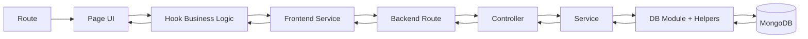
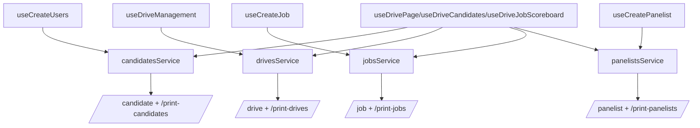
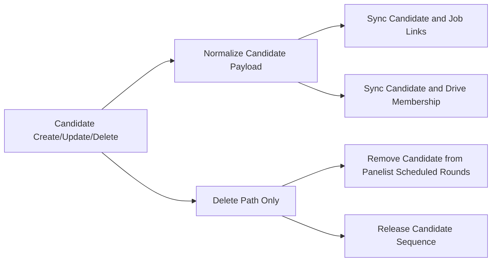

# Campus Recruitment App: Hooks, Variables, and Data Flow (Updated)

Last updated: 2026-03-06

This document explains how the current project works after the frontend split into UI and business-logic modules.

Use this file when you want to answer:
1. Which page calls which hook?
2. Which hook calls which API?
3. Which variables are important in each feature?
4. Where does data get normalized?

---

## 1) Core Mental Model

Frontend chain:
`Route -> Page (UI) -> Hook (Business Logic) -> Service -> API`

Backend chain:
`Route -> Controller -> Service -> DB module/helpers`

Cross-entity side effects are handled in DB helper functions (especially candidate/drive/job sync).

### Visual Map: System Flow

---

## 2) Route -> Page -> Hook Map

| Route | Page | Primary Hook(s) | Notes |
|---|---|---|---|
| `/login` | `LoginPage` | `useLoginPage` | Demo login via localStorage flags |
| `/candidate-dashboard` | `CandidateDashboard` | `useCandidateDashboard` | Candidate status, timeline, notifications |
| `/candidate/application` | `Applicationform` | `useCandidateApplicationForm` | Multi-step form, local save, submit |
| `/HR/dashboard` | `HRDashboard` | `useHrDashboard` | Top metrics |
| `/HR/dashboard/Drives` | `DriveManagement` | `useDriveManagement` | Drive CRUD, filters, edit modal |
| `/HR/dashboard/Drives/:driveId` | `DrivePage` | `useDrivePage` | Drive details, job breakdown |
| `/HR/dashboard/Create-Job` | `CreateJob` | `useCreateJob` | Job CRUD, row-click candidates modal |
| `/HR/dashboard/Create-Users` | `CreateUsers` | `useCreateUsers` | Candidate CRUD, CSV import/export, bulk actions |
| `/HR/dashboard/Manage-Panelists` | `CreatePanelist` | `useCreatePanelist` | Panelist CRUD, assignments, scheduling |
| `/HR/dashboard/drive/:driveId/job/:jobId/candidates` | `DriveCandidatesPage` | `useDriveCandidates` | Drive-job candidate table + details modal + contextual import |
| `/HR/dashboard/Drive-Job-Scoreboard` | `DriveJobCandidateScoreboardPage` | `useDriveJobScoreboard` | Selector mode leaderboard |
| `/HR/dashboard/drive/:driveId/job/:jobId/scoreboard` | `DriveJobCandidateScoreboardPage` | `useDriveJobScoreboard` | Context mode leaderboard |
| `/HR/dashboard/Recruitment-Pipeline` | `RecruitmentPipeline` | `useRecruitmentPipeline` | Flow template save/list/delete (localStorage) |
| `/HR/dashboard/Aptitude-Test-Management` | `AptitudeTestManagement` | `useAptitudeTestManagement`, `useAptitudeSelectionState` | Dispatch flow + local tracking |
| `/HR/dashboard/Offer-Approvals` | `OfferApprovals` | `useOfferApprovals` | UI-only static workspace |

---

## 3) Hook Input/Output Catalog

### 3.1 Core Page Hooks (`Frontend/src/hooks`)

- `useLoginPage({ navigate })`
  - Input: `navigate`
  - Output: `roleTabs`, `activeTab`, `email`, `password`, setters, `handleSubmit`
  - Side effects: sets/removes auth keys in localStorage and navigates.

- `useCandidateApplicationForm({ navigate })`
  - Input: `navigate`
  - Output: step state, `formData`, form updaters, resume handlers, `handleNext`, `handlePrevious`, `handleSubmit`
  - Side effects: reads/saves `candidate_application` localStorage key.

- `useCandidateDashboard({ navigate })`
  - Input: `navigate`
  - Output: `dashboardData`, loading/error, notification state/handlers, logout handler
  - Side effects: fetches candidate; reads saved application; resolves recruitment flow template.

- `useCreateUsers({ drivesProp })`
  - Input: optional drive list
  - Output: candidates/jobs/drives state, filter state, modal state, CRUD/import/export handlers
  - Side effects: API calls for candidate create/update/delete/bulk import.

- `useCreateJob({ onJobAssignment, onJobsUpdate })`
  - Input: optional callbacks
  - Output: jobs list/state, create/delete handlers, `getCandidatesForJob`
  - Side effects: API calls job list/create/delete; candidate list read.

- `useCreatePanelist({ onPanelistsUpdate })`
  - Input: optional callback
  - Output: panelist/job/candidate state, assignment/schedule modal state, CRUD handlers
  - Side effects: panelist APIs + fetch jobs/candidates.

- `useDriveManagement({ onDrivesUpdate })`
  - Input: optional callback
  - Output: drive/job lists, filter state, stats, create/delete/edit handlers
  - Side effects: drive and job APIs.

- `useDrivePage({ driveId })`
  - Input: drive id
  - Output: `drive`, `jobRows`, loading/error
  - Side effects: combines drives, candidates, panelists, jobs for one drive view.

- `useDriveCandidates({ jobName, driveId })`
  - Input: job name + drive id
  - Output: filtered candidates, loading/error, `reload`
  - Side effects: candidate/drive/job reads.

- `useDriveJobScoreboard({ driveId, jobName })`
  - Input: drive id + job name
  - Output: `rows`, `driveLabel`, `jobLabel`, loading/error
  - Side effects: candidate/drive/job/panelist reads.

- `useHrDashboard()`
  - Output: `candidateCount`, `panelistCount`, `totalDriveCount`.

- `useKonamiConfetti(colors)`
  - Output: none (effect hook)
  - Side effects: keyboard listener + temporary DOM confetti nodes.

- `useToast()`
  - Output: toast API (`show/success/error/info/warning`) from context or alert fallback.

- `useOfferApprovals()`
  - Output: static `offerItems` + `summaryCards`.

### 3.2 Feature Hooks (`Frontend/src/features/hr`)

- `useRecruitmentPipeline({ colors })`
  - Output: view state, drive/job selectors, selected stages, templates list, stats, save/delete handlers.
  - Storage: `recruitment_flow_templates_v1`.

- `useAptitudeTestManagement({ colors })`
  - Output: view state, selectors, search, candidate selection, dispatch log, send handler.
  - Storage: `aptitude_dispatch_log_v1`, `aptitude_dispatch_counter_v1`.

- `useAptitudeSelectionState(...)`
  - Output: selected drive/job candidates and select-all behavior.
  - Purpose: keeps selection logic isolated from page orchestration.

---

## 4) Prop Flow (UI Composition)

### Login
- `LoginPage`
  - uses `useLoginPage`
  - passes local hook state to input fields and form submit.

### Candidate Dashboard
- `CandidateDashboard`
  - passes hook output into:
    - `DashboardHeader` (`onToggleNotifications`, `onLogout`, notification props)
    - `ActionButtons` (`onViewApplication`, `onViewNotifications`)
    - `StatusCard`, `InterviewCard`, `ProgressTimeline`, `QuickInfoCard`.

### Candidate Application
- `Applicationform`
  - passes hook output into:
    - `StepTabs` (`activeStep`, `onStepClick`)
    - step components (`formData` + field update handlers)
    - `FormActions` (`onPrevious`, `onNext`, `onSubmit`).

### HR Main Pattern
Most HR pages follow:
- `HrShell`
- `SectionNavBar` with `activeKey` and `onChange` from page/hook
- page-specific cards/tables/modals.

### Recruitment Pipeline
- `RecruitmentPipeline` uses `useRecruitmentPipeline`
- delegates UI to:
  - `RecruitmentPipelineHomeView`
  - `RecruitmentPipelineBuilderView`
  - `RecruitmentPipelineListView`.

### Aptitude Test Management
- `AptitudeTestManagement` uses `useAptitudeTestManagement`
- delegates UI to:
  - `AptitudeHomeView`
  - `AptitudeDispatchView`
  - `AptitudeListView`
  - `AptitudeDispatchView` delegates table rendering to `AptitudeCandidatesTable`.

---

## 5) Frontend Service -> API Map

| Service | Method | Endpoint |
|---|---|---|
| `fetchCandidates` | GET | `/print-candidates?limit=...` |
| `createCandidate` | POST | `/candidate` |
| `bulkInsertCandidates` | POST | `/candidate/bulk` |
| `updateCandidate` | PATCH | `/candidate/:id` |
| `deleteCandidate` | DELETE | `/candidate/:id` |
| `fetchDrives` | GET | `/print-drives?limit=...` |
| `fetchDriveById` | GET | `/drive/:id` |
| `createDrive` | POST | `/drive` |
| `updateDrive` | PUT | `/drive/:id` |
| `deleteDrive` | DELETE | `/drive/:id` |
| `fetchJobs` | GET | `/print-jobs?limit=...` |
| `createJob` | POST | `/job` |
| `deleteJob` | DELETE | `/job/:id` |
| `fetchPanelists` | GET | `/print-panelists?limit=...` |
| `createPanelist` | POST | `/panelist` |
| `updatePanelist` | PUT | `/panelist/:id` |
| `deletePanelist` | DELETE | `/panelist/:id` |

`apiClient` base URL is `import.meta.env.VITE_API_BASE || ""`.

### Visual Map: Frontend API Surface

---

## 6) Backend Chain (Route -> Controller -> Service -> DB)

### Candidate
- `/candidate` -> `insertCandidateHandler` -> `createCandidate` -> `db/candidate/create.js#insertCandidate`
- `/candidate/bulk` -> `insertManyCandidatesHandler` -> `createManyCandidates` -> `db/candidate/create.js#insertManyCandidates`
- `/print-candidates` -> `printCandidatesHandler` -> `listCandidates` -> `db/candidate/read.js#printCandidates`
- `/candidate/:id` PATCH -> `editcandidateHandler` -> `updateCandidate` -> `db/candidate/update.js#editcandidate`
- `/candidate/:id` DELETE -> `deleteCandidateHandler` -> `removeCandidate` -> `db/candidate/delete.js#deleteCandidate`

### Drive
- `/drive` POST -> `insertDriveHandler` -> `createDrive` -> `db/drive.js#insertDrive`
- `/drive/:id` GET -> `getDriveByIdHandler` -> `getDrive` -> `db/drive.js#getDriveById`
- `/drive/:id` PUT -> `updateDriveHandler` -> `updateDrive` -> `db/drive.js#editDrive`
- `/drive/:id` DELETE -> `deleteDriveHandler` -> `removeDrive` -> `db/drive.js#deleteDrive`
- `/print-drives` GET -> `printDrivesHandler` -> `listDrives` -> `db/drive.js#printDrives`

### Job
- `/job` POST -> `insertJobHandler` -> `createJob` -> `db/job.js#insertJob`
- `/job/:id` DELETE -> `deleteJobHandler` -> `removeJob` -> `db/job.js#deleteJob`
- `/print-jobs` GET -> `printJobsHandler` -> `listJobs` -> `db/job.js#printJobs`

### Panelist
- `/panelist` POST -> `insertPanelistHandler` -> `createPanelist` -> `db/panelist.js#insertPanelist`
- `/panelist/:id` PUT -> `updatePanelistHandler` -> `updatePanelistRecord` -> `db/panelist.js#updatePanelist`
- `/panelist/:id` DELETE -> `deletePanelistHandler` -> `removePanelist` -> `db/panelist.js#deletePanelist`
- `/print-panelists` GET -> `printPanelistsHandler` -> `listPanelists` -> `db/panelist.js#printPanelists`

### Users
- `/Users` POST -> `insertUsersHandler` -> `createUser` -> `db/users.js#insertUsers`

---

## 7) ID Strategy and Normalization Rules

### Candidate IDs
- Human-friendly ID is generated as `CND###` via counter helpers.
- Deleted candidate IDs can be recycled through `releaseCandidateSequence`.

### Drive References in Candidate (important)
- Backend stores both:
  - `driveId` = MongoDB Drive `_id` (string)
  - `DriveID` = custom readable code (`DRV001`)
- Helper: `buildCandidateDriveFields` in `Backend/src/db/helpers.js`.
- Frontend should display `DriveID` (custom code) for user friendliness.

### Legacy field cleanup
- Candidate updates remove legacy keys (`AssignedJob`, `assignedDriveId`, `AssignedDriveId`).
- Drive updates remove legacy casing/aliases and keep canonical fields.
- Panelist updates remove legacy scheduled/assigned job keys.

---

## 8) LocalStorage Keys

### Auth/session
- `candidate_auth`
- `candidate_name`
- `candidate_email`
- `hr_auth`
- `hr_email`

### Candidate feature
- `candidate_application`

### Recruitment flow feature
- `recruitment_flow_templates_v1`

### Aptitude feature
- `aptitude_dispatch_log_v1`
- `aptitude_dispatch_counter_v1`

---

## 9) Important Side Effects You Must Remember

1. Candidate create/update/delete syncs job assignments and drive candidate lists.
2. Drive create/update/delete syncs job `Drive` map and candidate drive links.
3. Candidate delete also removes scheduled rounds from panelists.
4. Recruitment pipeline and aptitude dispatch are currently localStorage-driven (no backend persistence).

### Visual Map: Candidate Mutation Side Effects

---

## 10) Debug Checklist (Fast)

1. Confirm route and page mounted.
2. Confirm button/row event handler fires.
3. Confirm hook method runs and updates state.
4. Confirm service method and endpoint are correct.
5. Confirm backend route/controller/service/db chain.
6. Confirm side-effect sync (drive/job/panelist linkage).
7. Confirm UI refresh source (`load*`, `reload`, or derived `useMemo`).

---

## 11) Safe Extension Rules (for modular changes)

1. Keep business logic in hooks/feature logic files, not in large page components.
2. Keep UI components mostly presentational and prop-driven.
3. Prefer stable custom IDs for display and ObjectIds for internal linking.
4. Keep new files small and focused (single responsibility).
5. When adding feature modules, isolate constants, utils, hook, and view components.

If you follow these rules, adding a new module will have minimal impact on existing code.
