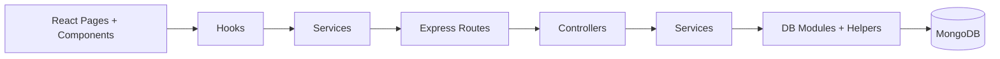
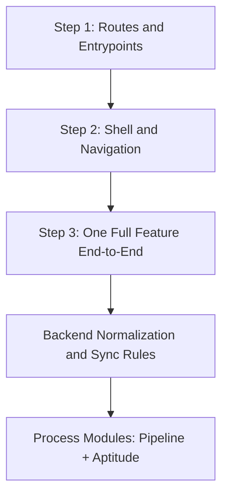
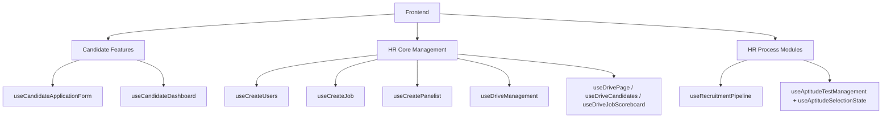

# Campus Recruitment App Learning Reference (Beginner -> Builder)

Last updated: 2026-03-06

This is your guided learning plan for this codebase.
If you follow this order, you will understand both frontend and backend quickly.

---

## 1) Before You Start

### What this project is
- Frontend: React + React Router + Tailwind + Axios
- Backend: Node.js + Express + MongoDB
- Data model: Candidate, Drives, Jobs, Panelist, Users

### What you should know first
- Frontend now uses a split structure:
  - UI files (Pages/Components)
  - Business logic hooks (Hooks + Feature hooks)
- Backend uses layered flow:
  - route -> controller -> service -> db/helpers

### Visual Map: Architecture Snapshot



---

## 2) Recommended Reading Order

### Step 1: Understand routes and app entry points
Open:
1. `Frontend/src/Routes/AppRoutes.jsx`
2. `Frontend/src/Routes/ProtectedRoute.jsx`
3. `Backend/src/app.js`
4. `Backend/src/routes/index.js`

Outcome:
- You can explain public vs protected routes.
- You can list all backend API route modules.

### Step 2: Understand shell/layout and navigation
Open:
1. `Frontend/src/Components/common/HrShell.jsx`
2. `Frontend/src/Components/common/HrSlideDrawer.jsx`
3. `Frontend/src/Components/common/SectionNavBar.jsx`

Outcome:
- You can explain how HR menu and in-page tabs work.

### Step 3: Learn one complete feature end-to-end
Start with Candidate Management:
1. `Frontend/src/Pages/HR/CreateUsers.jsx`
2. `Frontend/src/hooks/useCreateUsers.js`
3. `Frontend/src/services/candidatesService.js`
4. `Backend/src/routes/candidateRoutes.js`
5. `Backend/src/controllers/candidateController.js`
6. `Backend/src/services/candidateService.js`
7. `Backend/src/db/candidate/*`
8. `Backend/src/db/helpers.js`

Outcome:
- You can trace Create / Update / Delete / Bulk Import fully.

### Visual Map: Reading Roadmap



---

## 3) Feature Modules You Must Know

## 3.1 Candidate side
- `useCandidateApplicationForm`
- `useCandidateDashboard`
- `utils/candidateData.js`

Key ideas:
- Application form is step-based.
- Saved application uses localStorage (`candidate_application`).
- Dashboard merges saved application + live candidate fetch + flow template.

## 3.2 HR: Core management
- `useCreateUsers`
- `useCreateJob`
- `useCreatePanelist`
- `useDriveManagement`
- `useDrivePage`
- `useDriveCandidates`
- `useDriveJobScoreboard`

Key ideas:
- Candidates can be selected in bulk for assign/delete.
- Drive rows and job rows are clickable navigation surfaces.
- Scoreboard has selector mode and context mode.

## 3.3 HR: Process modules (recent split)
- `features/hr/recruitmentPipeline/*`
  - `useRecruitmentPipeline`
- `features/hr/aptitude/*`
  - `useAptitudeTestManagement`
  - `useAptitudeSelectionState`

Key ideas:
- Recruitment flow templates are saved in localStorage.
- Aptitude dispatch log and aptitude ID counter are localStorage-based.

### Visual Map: Feature Grouping



---

## 4) Backend Concepts You Need

### 4.1 Canonical fields and normalization
Read:
- `Backend/src/db/helpers.js`
- `Backend/src/db/drive.js`
- `Backend/src/db/panelist.js`
- `Backend/src/db/candidate/shared.js`

Important:
- Data may arrive in legacy key formats.
- DB layer normalizes to canonical fields.

### 4.2 Candidate/Drive/Job synchronization
Read:
- `syncCandidateDriveMembership`
- `syncJobsForCandidate`
- `linkJobsToDrive`
- `recalculateDriveCandidateStats`

Important:
- One write can trigger updates in multiple collections.

### 4.3 ID policy
- Candidate display ID: `CND###`
- Drive display ID: `DRV###` (custom ID)
- Candidate stores BOTH drive references:
  - `driveId` (Drive `_id`)
  - `DriveID` (custom readable ID)

Frontend should display custom IDs where possible.

---

## 5) How to Add a New Module Safely

Use this template:
1. Create route in `AppRoutes.jsx`.
2. Create page in `Pages/...` (UI composition only).
3. Create hook in `hooks/` or `features/.../useX.js` (business logic).
4. Create/extend service file for API calls.
5. Add backend route/controller/service/db only if persistence is required.
6. Add top-of-file doc block with:
   - logic file used
   - key fields
   - input/output type

Keep files small and focused.

---

## 6) Testing Strategy for Beginners

### Manual test pattern (for each feature)
1. Open page.
2. Perform create/update/delete action.
3. Confirm network request method + endpoint.
4. Refresh page.
5. Verify persisted result.
6. Verify linked side-effects (job/drive/panelist sync).

### Quick commands

Frontend:
```powershell
cd Frontend
npm run lint
npm run build
```

Backend:
```powershell
cd Backend
npm run dev
```

---

## 7) Suggested 7-Day Study Plan

Day 1:
- Routes and auth guard
- HR shell and drawer navigation

Day 2:
- Candidate management (CreateUsers + useCreateUsers)

Day 3:
- Drive management and Drive details flow

Day 4:
- Job and panelist management

Day 5:
- Scoreboard + Drive candidates contextual pages

Day 6:
- Recruitment Pipeline + Aptitude modules

Day 7:
- Backend helper sync logic + one small code change

---

## 8) Common Beginner Mistakes

1. Writing API calls directly inside page files.
2. Mixing display ID and database ID incorrectly.
3. Forgetting that delete/update may require cross-collection sync.
4. Updating only UI state but not persisting to backend.
5. Forgetting to re-fetch/reload after mutation.

---

## 9) What to Read Next (Reference Docs)

- `PROJECT_HOOKS_VARIABLES_FLOW.md` (system map)
- `PROJECT_FULL_DATA_FLOW_USER_INTERACTION.md` (click-to-event detailed flow)

Use these three docs together:
- Learning path
- Hook/variable map
- End-to-end interaction flow

That combination is enough to onboard a new beginner engineer.
